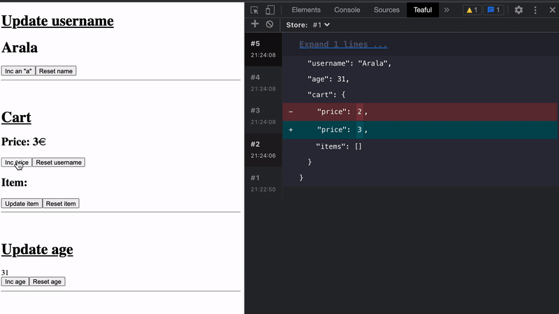

# Teaful DevTools

## Getting started

1. Install the DevTools extension

  - Chrome

2. Install the bridge in your app:

```
yarn add teaful-devtools
```

3. Should be called before any `createStore` call.

```js
import createStore from 'teaful'
import devtoolsBridge from 'teaful-devtools'

if (process.env.NODE_ENV === 'development') {
  devtoolsBridge()
}

const { useStore } = createStore({})
```

It's a function to call it in **develpment mode**.

It's not recommended in production since anyone could see all the store modifications and modify the content of the store.

So the responsibility lies with who uses the library.

4. Try it!

